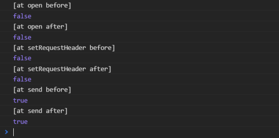
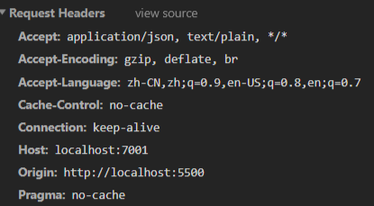
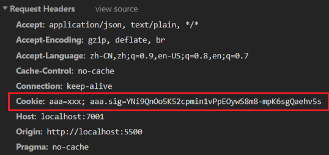
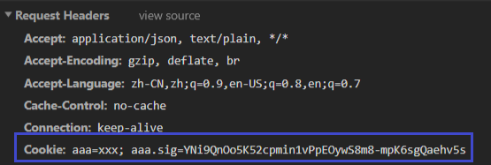

# 如何修复 MockJS 导致请求丢 Cookies 的问题

> MockJS 是用于前端开发时，拦截 XHR 异步请求，返回模拟数据的工具。
  但最新的 `1.0.1-beta3` 版本已经是 2016 年发布的了，基本处于跑路状态。
  这里用补丁的方式，对 Mock 对象做外科手术，尝试并修复了这个问题，以下是记录。

先放补丁代码：

```js
import Mock from 'mockjs'

Mock.XHR.prototype.__send = Mock.XHR.prototype.send
Mock.XHR.prototype.send = function () {
  if (this.custom.xhr)
    this.custom.xhr.withCredentials = this.withCredentials || false
  this.__send.apply(this, arguments)
}
```

## 问题描述

### 复现的条件

- 后端配置允许跨域
- 前端引用 MockJS 模块，并调用过 `Mock.mock()`
- 前端对后端做跨域请求
- 请求参数中设置 `withCredentials = true`
- 请求头中带 Cookies

### 引发的现象

后端接收不到 Cookies，前端通过 Network 查看相应的请求，Cookies 不存在。
各种依赖 Cookies 的认证都失效，用户无法登陆等。

### 相关的影响

- [https://github.com/nuysoft/Mock/issues/300](https://github.com/nuysoft/Mock/issues/300)
- [https://doc.d2admin.fairyever.com/zh/question](https://doc.d2admin.fairyever.com/zh/question/#%E5%BC%82%E6%AD%A5%E8%AF%B7%E6%B1%82%E6%97%A0%E6%B3%95%E6%90%BA%E5%B8%A6-cookie)
- [https://github.com/nuysoft/Mock/issues/286](https://github.com/nuysoft/Mock/issues/286)
- [https://github.com/PanJiaChen/vue-element-admin/issues/962](https://github.com/PanJiaChen/vue-element-admin/issues/962)
- [https://github.com/PanJiaChen/vue-element-admin/issues/562](https://github.com/PanJiaChen/vue-element-admin/issues/562)

## 分析调试

MockJS 是如何拦截 XHR 异步请求的？

在浏览器中发送异步请求，是通过 `new XMLHttpRequest` 创建了一个请求对象。
MockJS 通过重写这个全局的 XHR 对象，定制了一个可以不用发送真实请求，返回自定义数据的 XHR 对象。
在[代码注释中](https://github.com/nuysoft/Mock/blob/c4d7cba01900b5c5bb8e3d474c8f5d07810ab72e/src/mock/xhr/xhr.js#L31)说明了为什么要重写：

> 关键属性 readyState、status、statusText、response、responseText、responseXML 是 readonly，所以，试图通过修改这些状态，来模拟响应是不可行的。
  因此，唯一的办法是模拟整个 XMLHttpRequest，就像 jQuery 对事件模型的封装。

这样做的代价也大，不过被 MockJS 重写过的 XHR 对象，上述的关键属性早已不是 readonly，可以自由读写。
由此根据 XHR 生命周期中的几个函数做包装，打印每个阶段的数据状态，
这几个阶段在 MDN 中有[详细的描述](https://developer.mozilla.org/zh-CN/docs/Web/API/XMLHttpRequest#%E6%96%B9%E6%B3%95)。

### 后端配置

因为需要后端配合才能复现，这里提供 EggJS 后端的配部分置及代码，根目录为 `my-egg-app`。

`my-egg-app/config.default.js`：
```js
  // ...

  // ! cors for dev
  config.security = {
    domainWhiteList: ['*'],
    methodnoallow: {
      enable: false,
    },
    xframe: {
      enable: false,
    },
    csrf: {
      enable: false,
      ignoreJSON: false,
    }
  }
  config.cors = {
    credentials: true
  }

  // ...
```

`my-egg-app/plugin.js`：
```js
  // ...

  // ! cors for dev
  exports.cors = {
    enable: true,
    package: 'egg-cors'
  }

  // ...
```

`my-egg-app/app/router.js`：
```js
  // ...

  const { router, controller } = app
  router.get('/', controller.home.index)

  // ...
```

`my-egg-app/app/controller/home.js`：
```js
'use strict'

const Controller = require('egg').Controller

class HomeController extends Controller {
  async index() {
    this.ctx.cookies.set('aaa', 'xxx')
    this.ctx.body = 'hi, egg'
  }
}

module.exports = HomeController
```

### 前端调试

前端代码如下：

```html
<!DOCTYPE html>
<html>
<head>
  <!-- 传统方式引入 MockJS -->
  <script src="https://cdn.bootcss.com/Mock.js/1.0.1-beta3/mock-min.js"></script>
  <!-- 发送异步请求的模块 -->
  <script src="https://cdn.bootcss.com/axios/0.19.0-beta.1/axios.min.js"></script>
</head>
<body>
  <h1>Mock Test</h1>
  <script type="text/javascript">

    // 设置一个无用的 mock
    Mock.mock('/test', 'get', {})

    // 已经被 MockJS 换掉的 XHR
    var XHR = XMLHttpRequest;

    // 手动实现自动包装器
    function autoWrapper(source, wrap) {
      for (var key in wrap) {
        if (typeof wrap[key] === 'function' && source[key] && typeof source[key] === 'function') {
          (function (key, wkey) {
            source[wkey] = source[key]
            source[key] = function () {
              var self = this
              var args = arguments
              return wrap[key](self, args, function () { self[wkey].apply(self, args) })
            }
          })(key, 'wrap__'+key)
        }
      }
    }

    // 植入探测代码
    autoWrapper(XHR.prototype, {
      open(self, args, run) {
        console.log('[at open before]')
        console.log(self.withCredentials)

        var rst = run(args)

        console.log('[at open after]')
        console.log(self.withCredentials)

        return rst
      },
      setRequestHeader(self, args, run) {
        console.log('[at setRequestHeader before]')
        console.log(self.withCredentials)

        var rst = run(args)

        console.log('[at setRequestHeader after]')
        console.log(self.withCredentials)

        return rst
      },
      send(self, args, run) {
        console.log('[at send before]')
        console.log(self.withCredentials)

        var rst = run(args)
        
        console.log('[at send after]')
        console.log(self.withCredentials)
        
        return rst
      }
    })
    
    // 发送一个请求
    axios({
      method: 'get',
      url: 'http://localhost:7001/', // 测试用的 EggJS 服务器
      withCredentials: true
    }).then(function (res) {
      // ...
    })

  </script>
</body>
</html>
```

以上测试代码试图在 XHR 的三个方法中植入代码，既然这个问题和 `withCredentials` 有关，
那就在 XHR 的不同阶段打印 XHR 实例的 `withCredentials` 值，看看到底是哪里出了问题。

结果如下：



后端已经声明 `set-cookies`，但前端发送的请求里并没有带回执的 Cookies ：



但是注释掉 `Mock.mock(...)` ，就正常了：



这个请求并没有被 MockJS 拦截，但仍然受 MockJS 影响，查阅代码，发现原生 XHR 的 `withCredentials` 被 MockJS 默认为 `false`，
并且在后续操作中被遗忘了，[看这里](https://github.com/nuysoft/Mock/blob/c4d7cba01900b5c5bb8e3d474c8f5d07810ab72e/src/mock/xhr/xhr.js#L257)。

未被拦截的请求，MockJS 会用原生的 XHR 发送出去，
相关代码在 `send` 函数中，[看这里](https://github.com/nuysoft/Mock/blob/c4d7cba01900b5c5bb8e3d474c8f5d07810ab72e/src/mock/xhr/xhr.js#L267)，
就会发现这个原生的 XHR 被藏在 `this.custom.xhr` 这个位置，这时改写一下 `send` 部分的测试代码，分别在 `send` 被调用的前后两阶段检查一下
这个原生 XHR 的 `withCredentials`：

```js
  // ...
  
  send(self, args, run) {
    console.log('[at send before]')
    console.log(self.withCredentials, self.custom.xhr.withCredentials)

    var rst = run(args)
    
    console.log('[at send after]')
    console.log(self.withCredentials, self.custom.xhr.withCredentials)
    
    return rst
  }

  // ...
```

发现线索了：


只有在 `send` 时期，自定义的 `withCredentials` 才会被挂载到 XHR 实例上，但是 MockJS 忘了给未被拦截的原生 XHR 挂上
这个自定义的 `withCredentials`，那就只有在 `send` 之前，自己去挂一下。因为被拦截的 XHR 是没有 `this.custom.xhr` 的，所以这里还要做个判断，
并提供默认值 `false`：

```js
  // ...
  
  send(self, args, run) {
    console.log('[at send before]')
    console.log(self.withCredentials, self.custom.xhr.withCredentials)
    
    // here
    if (self.custom.xhr) {
      self.custom.xhr.withCredentials = self.withCredentials || false
    }

    var rst = run(args)
    
    console.log('[at send after]')
    console.log(self.withCredentials, self.custom.xhr.withCredentials)
    
    return rst
  }

  // ...
```


Cookies 已经有了：



问题告一段落，MockJS 可能还会引发其他一些问题，在以后的实践中有待学习。

<PrettyComment />
